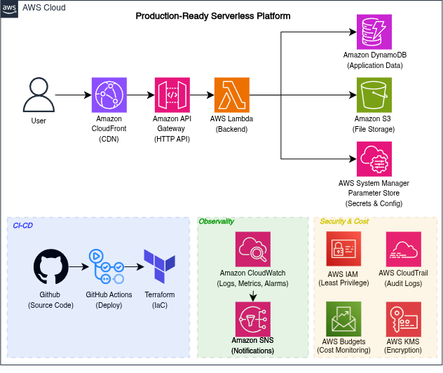

# NimbusOps: Production-Ready Serverless Platform on AWS

[](https://github.com/mdiksann/nimbusops/actions/workflows/deploy.yml)
[](https://www.terraform.io/)
[](https://registry.terraform.io/providers/hashicorp/aws/latest)
[](https://www.python.org/)

**NimbusOps** is an enterprise-grade, highly available, and cost-effective serverless cloud architecture built on **Amazon Web Services (AWS)** using **Terraform (Infrastructure as Code)** and automated via **GitHub Actions CI/CD** with secure **OpenID Connect (OIDC)** authentication.

---

## Architecture Overview



The platform is designed around four core pillars:

### 1. Serverless Application Layer
* **Amazon CloudFront (CDN):** Global Edge distribution providing low-latency caching, DDoS mitigation, and SSL/TLS HTTPS termination.
* **Amazon API Gateway (HTTP API v2):** Lightweight, cost-optimized API gateway handling route management, CORS, and request forwarding.
* **AWS Lambda:** Event-driven backend compute running Python with zero idle costs and automatic horizontal scaling.
* **Amazon DynamoDB:** Fully managed NoSQL database providing single-digit millisecond latency for service metadata.
* **Amazon S3:** Scalable, encrypted object storage for static files and application assets with lifecycle versioning.
* **AWS Systems Manager Parameter Store:** Centralized, secure storage for environment configurations and runtime parameters.

### 2. CI/CD & Infrastructure as Code (IaC)
* **Terraform:** Declarative infrastructure provisioning with remote state storage in **Amazon S3** and native state locking.
* **GitHub Actions:** Automated pipeline validating code formatting (`terraform fmt`), linting, planning on pull requests, and deploying on merge to `main`.
* **GitHub OIDC (OpenID Connect):** Short-lived, temporary AWS IAM credentials without storing static `AWS_ACCESS_KEY_ID` or `AWS_SECRET_ACCESS_KEY` secrets in GitHub.

### 3. Observability & Incident Response
* **Amazon CloudWatch:** Comprehensive telemetry logging for Lambda execution, request durations, and error metrics.
* **Metric Filters & Alarms:** Automated log inspection for `ERROR` levels and Lambda invocation failures.
* **Amazon SNS:** Real-time email alerting triggered immediately when system anomalies or errors occur.

### 4. Security & Cost Governance
* **AWS IAM (Principle of Least Privilege):** Granular IAM policies restricting Lambda and GitHub Actions strictly to required actions and resources.
* **AWS Budgets:** Proactive cloud financial management with monthly USD spending limit alarms.
* **AWS KMS & S3 Encryption:** AES-256 server-side encryption at rest across storage buckets.

---

## Repository Structure

```text
nimbusops/
├── .github/
│   └── workflows/
│       ├── deploy.yml            # CI/CD deployment on push to main
│       └── terraform-plan.yml    # Pull request validation and terraform plan
├── app/
│   └── lambda_function.py        # Core Python serverless REST API logic
├── docs/
│   └── architecture.png          # Architecture diagram
├── terraform/
│   ├── api-gateway.tf            # HTTP API routes, stages, integrations
│   ├── budgets.tf                # AWS Budgets configuration and notifications
│   ├── cloudfront.tf             # CloudFront CDN distribution & cache policies
│   ├── dynamodb.tf               # DynamoDB table definitions
│   ├── github-oidc.tf            # AWS IAM OIDC identity provider & trust role
│   ├── iam.tf                    # Lambda IAM execution roles and policies
│   ├── lambda.tf                 # Lambda function packaging and configuration
│   ├── locals.tf                 # Naming prefixes and common resource tags
│   ├── monitoring.tf             # CloudWatch alarms, dashboard, and SNS topic
│   ├── monitoringg.tf            # Metric filter for structured error logs
│   ├── outputs.tf                # Infrastructure output values (API URLs, ARNs)
│   ├── parameter-store.tf        # SSM Parameter Store configurations
│   ├── providers.tf              # AWS provider and remote S3 backend settings
│   ├── s3.tf                     # Asset storage bucket & security policies
│   ├── terraform.tfvars.example  # Example input variables
│   └── variables.tf              # Input variable declarations
└── README.md
```

---

## API Endpoints Reference

| Method | Endpoint | Description | Expected Status |
| :--- | :--- | :--- | :--- |
| `GET` | `/health` | Service health check and diagnostics | `200 OK` |
| `GET` | `/services` | List all registered service items | `200 OK` |
| `GET` | `/services/{id}` | Retrieve details of a specific service | `200 OK` / `404 Not Found` |
| `POST` | `/services` | Create a new service record (`name`, `status`) | `201 Created` / `400 Bad Request` |
| `PUT` | `/services/{id}` | Update an existing service record | `200 OK` / `400 Bad Request` |
| `DELETE` | `/services/{id}` | Remove a service item from DynamoDB | `204 No Content` |
| `GET` | `/test/error` | Controlled exception route for observability tests | `500 Internal Error` |

---

## Quick Start Guide

### Prerequisites
* [Terraform](https://www.terraform.io/downloads.html) (>= 1.8.0)
* [AWS CLI](https://aws.amazon.com/cli/) configured with deployment permissions
* [Python](https://www.python.org/) (>= 3.12)
* [Git](https://git-scm.com/)

---

### 1. Clone the Repository
```bash
git clone https://github.com/mdiksann/nimbusops.git
cd nimbusops
```

---

### 2. Configure Environment Variables
Create your local `terraform.tfvars` from the provided example:
```bash
cp terraform/terraform.tfvars.example terraform/terraform.tfvars
```

Update `terraform/terraform.tfvars`:
```hcl
alert_email        = "your-email@example.com"
monthly_budget_usd = 5
github_repository  = "your-username/nimbusops"
```

---

### 3. Deploy via Terraform

```bash
cd terraform

# Initialize Terraform with modules and providers
terraform init

# Validate syntax and configuration
terraform validate

# Review the execution plan
terraform plan

# Provision the cloud resources
terraform apply -auto-approve
```

---

### 4. Configure GitHub Actions CI/CD (OIDC)

To enable automatic continuous deployment without static AWS access keys:

1. In your GitHub repository, navigate to **Settings** > **Secrets and variables** > **Actions**.
2. Add the following repository secrets:
   * **`AWS_ROLE_ARN`**: The ARN output from Terraform (`terraform output -raw github_actions_role_arn`).
   * **`ALERT_EMAIL`**: The email address designated for CloudWatch alerts and budget notifications.
3. Push changes to the `main` branch:
   ```bash
   git add .
   git commit -m "feat: deploy serverless platform"
   git push origin main
   ```
4. View real-time deployment status under the repository's **Actions** tab.

---

## Verification & Failure Testing

Once deployed, verify your endpoints directly using `curl`:

```bash
# Retrieve the deployed endpoint URL
API_URL=$(terraform output -raw api_gateway_url)

# 1. Health Check (Expected: 200 OK)
curl -i "$API_URL/health"

# 2. Create Service Item (Expected: 201 Created)
curl -i -X POST "$API_URL/services" \
  -H "content-type: application/json" \
  -d '{"name":"nimbusops","status":"active"}'

# 3. Retrieve Items (Expected: 200 OK)
curl -i "$API_URL/services"

# 4. Invalid Payload Validation (Expected: 400 Bad Request)
curl -i -X POST "$API_URL/services" \
  -H "content-type: application/json" \
  -d '{"status":"active"}'

# 5. Controlled Failure Test (Expected: 500 Internal Error + SNS Alert)
curl -i "$API_URL/test/error"

# 6. Tail CloudWatch Logs in Real Time
aws logs tail "/aws/lambda/nimbusops-dev-api" --since 10m --region ap-southeast-1 --follow
```

---

## Teardown & Resource Cleanup

To destroy all provisioned cloud infrastructure and avoid ongoing AWS charges:

```bash
cd terraform
terraform destroy -auto-approve
```

---

## License
This project is licensed under the **MIT License**.

